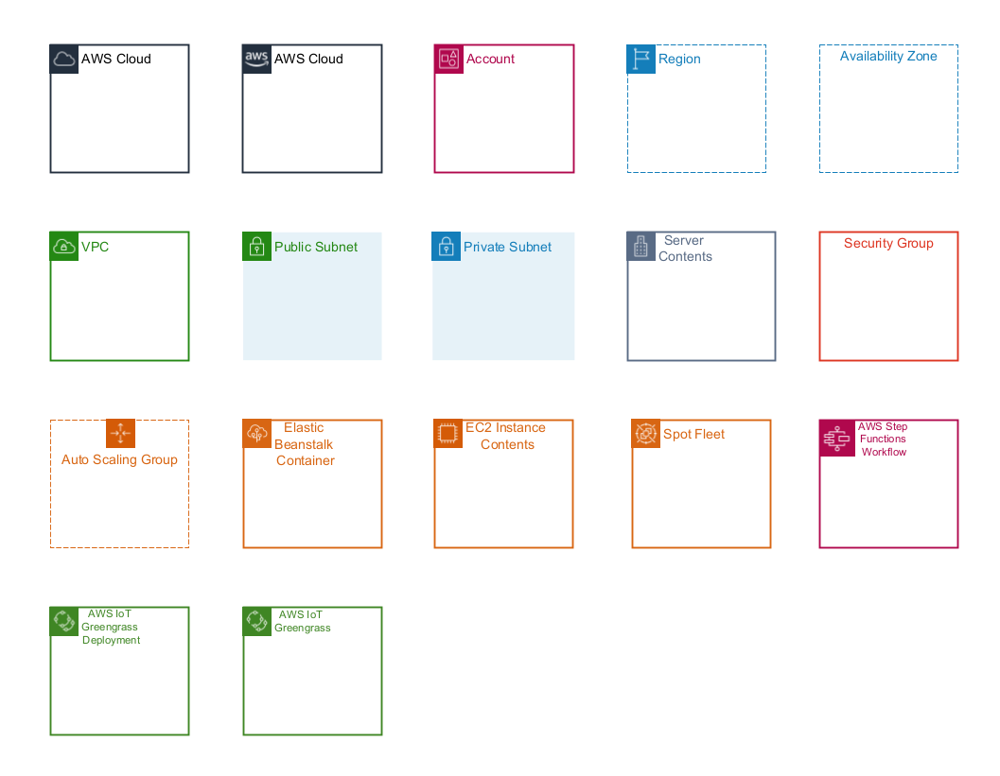

# AWS Group Icon Palette for yEd

[yED](https://www.yworks.com/en/products/yfiles/yed/) is an awesome diagraming software. 

This repository contains pre-made palettes for Group Nodes like the one in [draw.io](https://app.diagrams.net/) to import into yED to create great modern AWS archiecture diagrams with the layouting support of yEd!

To hide the Group Node Button, go to "File" -> "Settings" -> "Display" -> select "never show group state" in "Group State Symbol".

